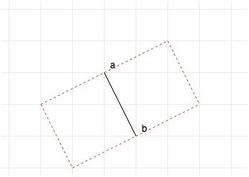

# Problem
Given a set S of n points in the plane, how many subsets of four points that form the vertices of a square does it contain ? Both the axis-parallel case and the arbitrarily oriented case are studied.
For example: 
* [-1,-1][2,1][4,-2][1,-4] is a valid square.
* [0, 0][0, 2][2, 0][2, 2] is a valid square.

# Solution

## Commands

if you want to launch the execution:
```bash
python3 squares.py
```
## Description

The following algorithm propose a solution to this problem. We will proceed as follow:
1.  Create a Hash Table and insert all the points in it.
2.  For every pair of points a & b, search in the Hash Table whether the 4 other points forming the vertices of any of the two squares defined by the vertice (a,b) are existing. If so, increment a counter.



In this way, a square will be counted 4 times as the number of his vertices. The counter should therefore be divised by 4 at the end of the execution.

## Evaluation
If we suppose that we use a perfect hash function to build the hash table, we can say that the time complexity is O(n²) since the search for the points in the hash table has a time complexity of O(1). Otherwise, the time complexity in the worst-case is O(n³). The space complexity is always O(n). 

The time of execution of this program is **205 seconds** (3 minutes 25 seconds)

The result of the algorithm applied on the dataset **points.txt** composed of 10000 points is: **56 squares**.

## Possible Optimizations

* Implement a perfect hash function to guarantee that the time complexity of the search in tha hash table is O(1) + h where h is the time taken by the hash function.

* Try to count a square once and not 4 times.

* Use a binary search tree instead of a hash table. The time complexity of the search in a binary search tree is O(log(n)) in the worst-case. It could be better than the performance of a hash table: the worst-case time for searching is O(n) (all the keys hash to the same slot). We've used a hash table anyway for the its average-case performance that can be O(1).

* Use a multithread approach to speed up the process
